# Описание

Это - сборник формул и  по математике и смежным дисциплинам. Он написан в формате `.tex`, но его можно скомпилировать в `.pdf` файл, либо из этого файла составить картинку, которую можно распечатать и заламинировать.

Последняя версия `.pdf` файла, и картинка, пригодная для распечатки находятся в секции `release`.

Здесь, конечно же, не будут собраны формулы все до единой, а только те, которые используются чаще всего, показывают некоторые нюансы, либо могут ускорить решение задачи. Так же будет соблюдаться принцип `минимальной необходимой информации для вывода` - будет написано столько информации, чтобы за один шаг логического вывода можно было получить всё необходимое. 

# Будущее проекта

На данный момент никакого смысла и мотивации заканчивать проект нет, потому что учёба закончилась и мне это больше не нужно. А другие люди даже не заглядывают на гитхаб. Так что если это стало вам интересно - ставьте звёзды, просите друзей ставить звёзды, может от социального одобрения у меня появится смысл продолжить эту репу (а у меня ещё так много формул на физических листочках и в сохранённых картинках, вы не представляете...).

# Фичи

Что интересного есть в этом сборнике формул? (Внимание, много не закончено)

## Маленькие секции:
* Таблица квадратов, таблица степеней
* Формулы сокращённого умножения
* Квадратное уравнение, выделение полного квадрата
* Симметричное уравнение
* Определение и свойства НОД и НОК
* Комбинаторика (с примерами)

## Для следующих секций имеются все необходимые формулы, задающие полный набор всех возможных преобразований:
* Модуль
* Корень
* Логарифм
* Арифметическая и геометрическая прогрессия
* Гамма-функция
* Бета-функция

## Формулы тригонометрии:
* Графики всех функций
* Основные формулы
* Сумма углов
* Двойных и тройных углов
* Сумма функций в произведение
* Произведение функций в сумму
* Понижение степени и половинный угол
* Формулы приведения
* Тригонометрические равенства
* Обратные тригонометрические функции
* Таблица значений тригонометрии для стандартных углов
* Таблица значений для особых углов

## Формулы гиперболики:
* Основные
* Суммы углов
* Двойные и тройные углы
* Сумма функций
* Произведение функций

## Математический анализ:
* Пределы
* Замечательные и элементарные пределы
* Эквивалентности
* Таблица производных
* Ряды и формула Тейлора
* Свойства определённого интеграла
* Таблица неопределённых интегралов
* Приложения определённого интеграла
* Исследование функции
* Матан над функциями нескольких переменных
* Дифференцирование вектор-фукнции

## Методы интегрирования:
* Интегрирование рациональных радикалов
* Подстановка эйлера
* Подставнока Чёбышева
* Интегралы от тригонометрических функций в степени n
* Универсальная тригонометрическая подстановка

## Формулы для координат с якобианами:
* Полярные
* Сферические

## Комплексные числа:
* Арифметика
* Аргумент (фаза) комплексного числа
* Сопряжение
* Формула Муавра
* Выражение обычных фукций в комплексном виде
* Степень и корень из комплексного числа

## Линейная алгебра:
* Матрица перехода от одного базиса к другому
* Линейный оператор
* Билинейная форма
* Различные расстояния в евклидовых пространствах

## Геометрия: (пока что без картинок). 
* Формулы для вычисления ВСЕГО внутри треугольника
* Правильный многоугольник
* Трапеция
* Стереометрия (маловато)

## Теория вероятностей:
* Операции над множеством событий
* Формулы для преобразований множеств
* Формулы классической вероятности
* Свойства P(A)
* Относительная вероятность
* Формула полной вероятности
* Схема Бернулли
* Функция распределения
* Дискретная случайная величина
* Плотность распредлеения
* Математическое ожидание
* Дисперсия
* Формулы и свойства стандартных распределений

## Самые сочные части в картинках:

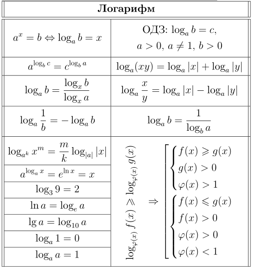

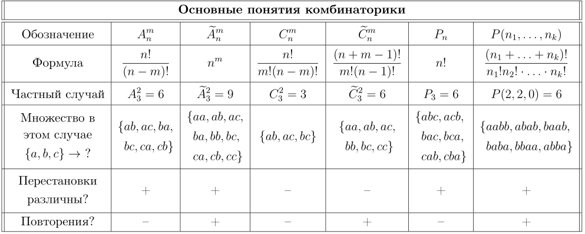

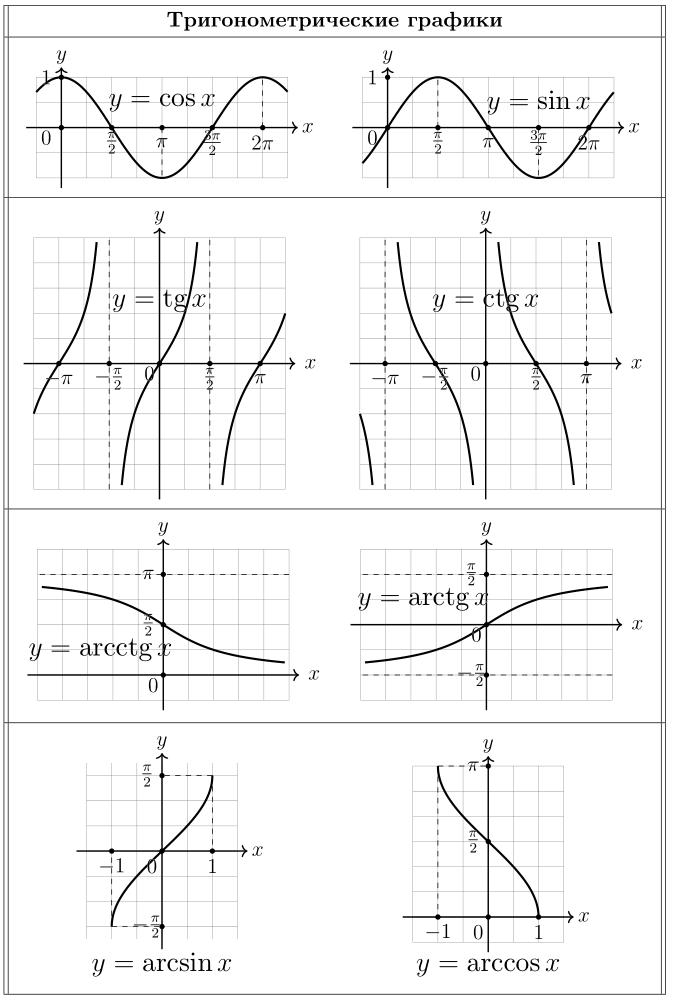

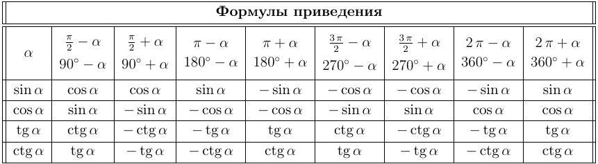

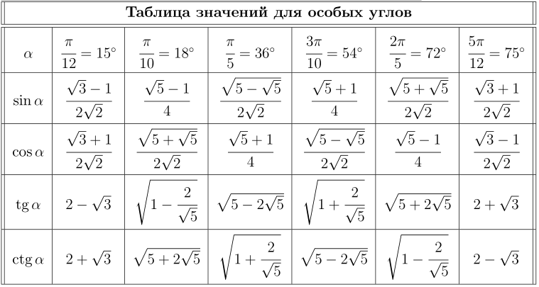

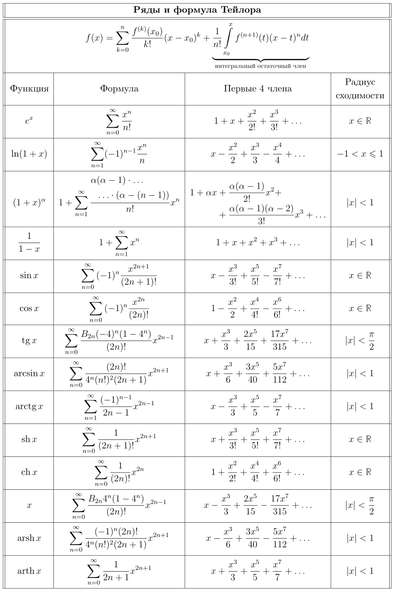

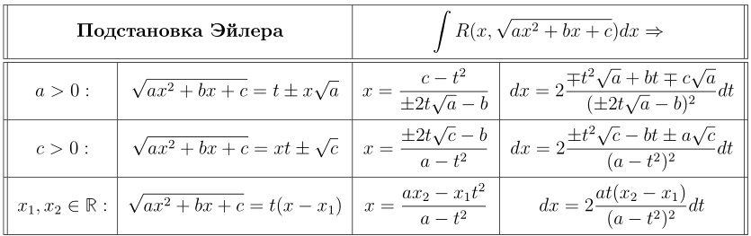

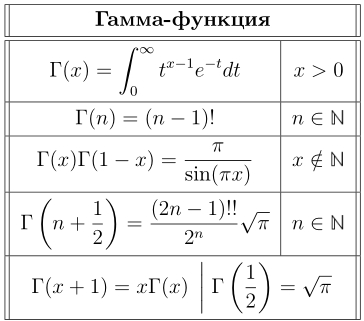

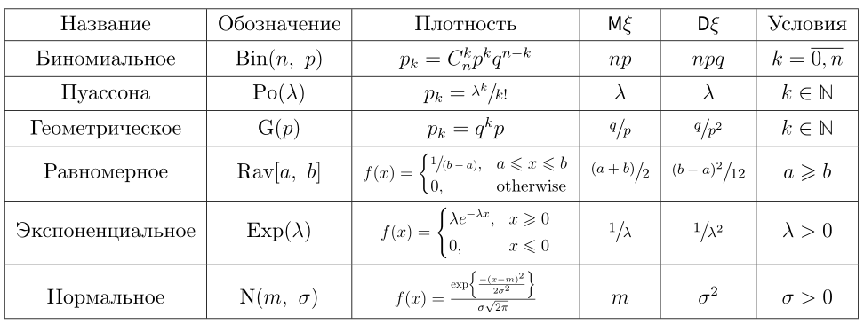

# Собрать все формулы на один листочек

В идеале что я хочу сделать - это собрать все таблицы и разместить их на листочке, чтобы при помощи чуда печати, можно было их ВСЕ распечатать на двух сторонах А4, заламинировать это и пользоваться с 7 класса до конца университета.

Хотелось бы делать по аналогии с этим сборником формул:

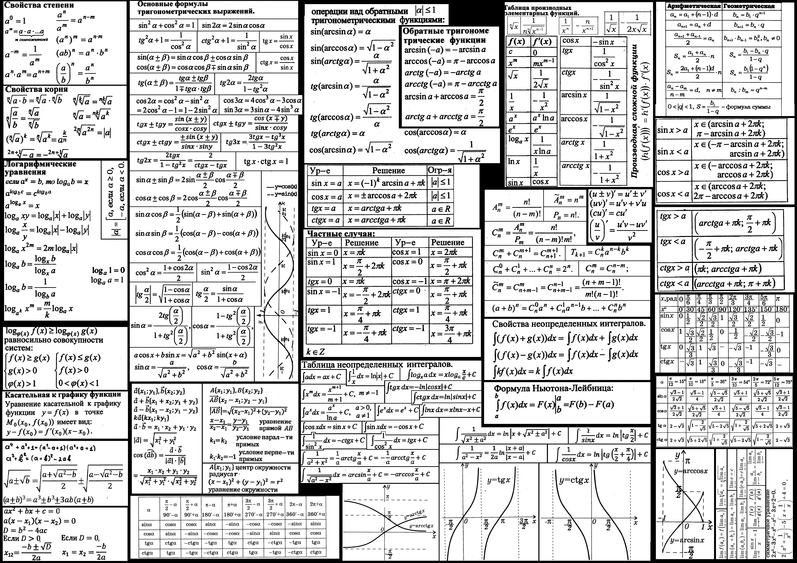

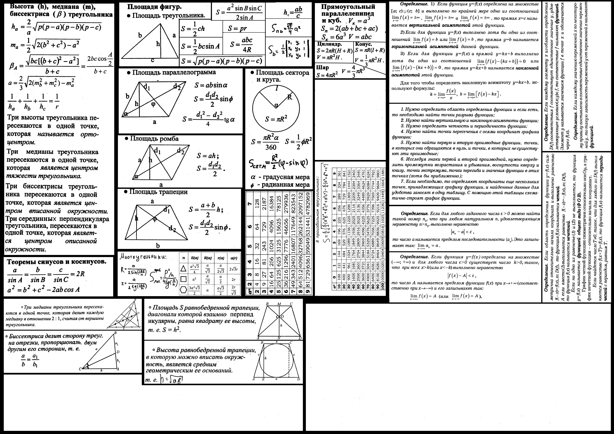

Создал его тоже я (сканируя просто книги и написанные вручную формулы). Кстати, можете распечатать это, в школе эти картинки пользовались популярностью.

Создавая этот репозиторий на основе этих картинок. Правда здесь уже намного больше. Как минимум университетская программа.

Хотите такие же картинки, только для новых формул и более графонистые? Смотрите пункт `Будущее` :)

# Компиляция

Для пользователей Windows - скачиваем texlive с официального сайта. 

Для пользователей Linux - устанавливаем `sudo apt install texlive-full`.

Далее, в папке, где находится файл, в командной строке прописываете команду: `xelatex main_file.tex`. Вы получите `main_file.pdf`.

# Цитатки от меня

> Лучший способ выучить формулу - пользоваться ей. 

> Не обязательно точно помнить формулу, главное знать что она есть; где и как ее можно применить; и как из неё можно вывести другие формулы.

# Copyright

Автор: Шепрут Илья.

Лицензия: `GPLv2.0`